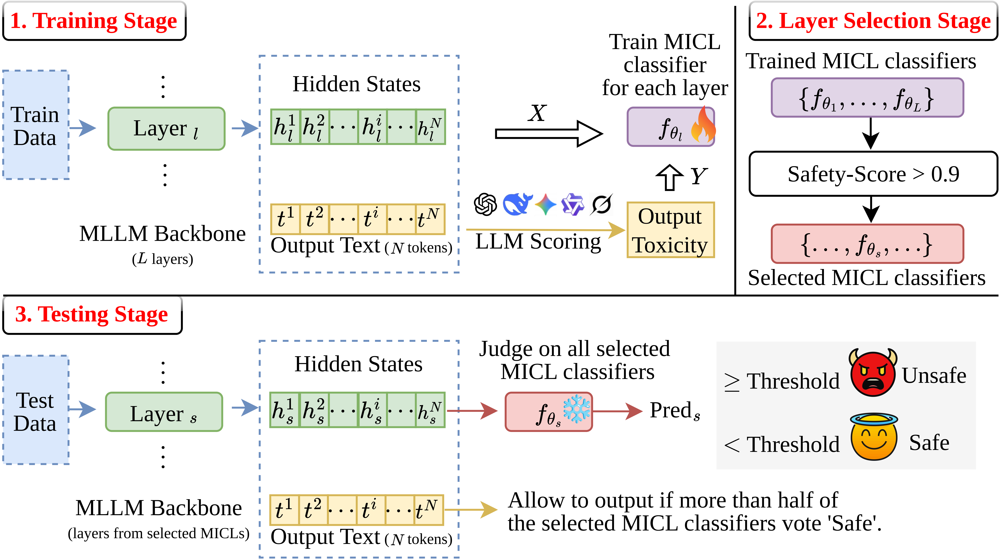

# [](https://arxiv.org/abs/2602.18845) **[ECCV 2026] Safe responses matter: Output-aware safety guardrail mitigate over-refusal in MLLMs** 

## Abstract

Existing safety mechanisms for multimodal large language models (MLLMs) face a fundamental trade-off between safety and utility. Model fine-tuning achieves robust safety but compromises general utility. Input-side safety guardrails offer a lightweight alternative, yet they suffer from severe over-refusal, indiscriminately blocking benign queries or those the model could have safely answered through refusal or advisory responses. We identify that the root cause of over-refusal lies in the input-aware paradigm: safety guardrails make safety decisions without considering whether the model itself is capable of generating safe responses. Usually, MLLMs already possess intrinsic safety mechanisms that can transform harmful inputs into harmless outputs, but input-side safety guardrails override this capability, degrading user experience. Motivated by this insight, we propose a paradigm shift toward output-aware safety guardrails. Our method operates within the model's hidden state space to predict whether the forthcoming generation will be unsafe before it is fully produced. By training a lightweight classifier via multi-instance contrastive learning on hidden state representations, our approach distinguishes between inputs that will lead to unsafe outputs and those that will not, even when the inputs themselves contain risky elements. This enables precise intervention only when the model's actual response would be harmful. Extensive experiments demonstrate that our output-aware safety guardrail matches the safety performance of existing methods while drastically reducing over-refusal, preserving the model's utility and built-in safety capabilities.

## Approach


## Contents

- [Install](#-install)  
- [Dataset](#-dataset)
- [Demo with `llava_1_6`](#-Demo-with-'llava_1_6')
- [Citation](#-Citation)


## Install

```bash
conda env create -f environment.yml
conda activate OutGuard
pip install -e LLaVA
pip install torch==2.6.0 torchvision==0.21.0 torchaudio==2.6.0 --index-url https://download.pytorch.org/whl/cu124
pip install flash-attn==2.7.3 xformers==0.0.29.post3 --no-build-isolation
```

when use [llava](https://huggingface.co/liuhaotian/llava-v1.6-vicuna-7b), 
```bash
pip install -e transformers
```

when use [qwen](https://huggingface.co/Qwen/Qwen3.5-9B), 
```bash
pip install transformers==5.12.1
```


## Dataset

We evaluate the performance of **OutGuard** using various popular benchmark datasets, including:

| **Dataset Source** | **Use for** | **Usage Details** |
|--|--|--|
| [SafeBench](https://huggingface.co/datasets/Zonghao2025/safebench) | Train & Test Set | Download and extract the dataset into `dataset/safebench/` |
| [AdvBench](https://anonymous.4open.science/r/Learning-to-Detect-51CB) | Train & Test Set  | Images are located in the `baseline/LoD/asset/advbench` |
| [GQA](https://anonymous.4open.science/r/Learning-to-Detect-51CB) | Train & Test Set  | Images are located in the `baseline/LoD/asset/GQA` |
| [MM-SafetyBench](https://github.com/isXinLiu/MM-SafetyBench) | OOD Set | Questions can be found in this repo (data/processed_questions); Images can be downloaded from [Google Drive](https://drive.google.com/file/d/1xjW9k-aGkmwycqGCXbru70FaSKhSDcR_/view?usp=sharing). Save into `dataset/MM-SafetyBench` |
| [MM-Vet](https://github.com/yuweihao/MM-Vet/releases/download/v1/mm-vet.zip) | OOD Set | EXtract into `dataset/mm-vet` |
| [Visual Adversarial Examples](https://github.com/Unispac/Visual-Adversarial-Examples-Jailbreak-Large-Language-Models) | Jailbreak Data | clone into `attacks/Visual-Adversarial-Examples` |
| [HADES](https://drive.google.com/drive/folders/1k4coKdLd_iLhwyTyWmz8nQ0thN4D01qc?usp=sharing) | Jailbreak Data | `dataset/HADES` |
| [JOOD](https://github.com/naver-ai/JOOD) | Jailbreak Data | Adversarial images generated after attacks are stored in `dataset/AdvBenchM` |
[XSTest](https://huggingface.co/datasets/walledai/XSTest) | Seemly harmful but benign Data | `dataset/XSTest` |


## Demo with `llava_1_6`
> When using Qwen, replace `llava_1_6` with `qwen_3_5`.

### If you want to directly use OutGuard for inference:

```bash
python inference.py -m llava_1_6 --log
```

### If you want to conduct training and testing:

Extract the hidden state representations
```bash
python llava_1_6/response.py --data SafeBench -d cuda
```

Score outputs on different datasets using five different LLM judges, Here, we take `Safebench` as an example
```bash
bash judge.sh llava_1_6 SafeBench qwen
bash judge.sh llava_1_6 SafeBench deepseek
bash judge.sh llava_1_6 SafeBench gpt
bash judge.sh llava_1_6 SafeBench gemini
bash judge.sh llava_1_6 SafeBench grok
```
> Applied the same procedure to other harmful datasets: `AdvBench`, `MM-SafetyBench`, `Visual-Adversarial-Examples`, `HADES`, and `JOOD`.


OutGuard
```bash
# Stage 1: Train OutGuard
python main.py -m llava_1_6 --train

# Stage 2: Layer Selection
python main.py -m llava_1_6 --choose_layer

# Stage 3: Test OutGuard
python main.py -m llava_1_6 --test_data test_set --log                            # test set
python main.py -m llava_1_6 --test_data "MM-SafetyBench+MM-Vet" --log             # test ood data
python main.py -m llava_1_6 --test_data "Visual-Adversarial-Examples" --log       # test jailbreak
python main.py -m llava_1_6 --test_data HADES --log                               # test jailbreak
python main.py -m llava_1_6 --test_data JOOD --log                                # test jailbreak
python main.py -m llava_1_6 --test_data XSTest_safe_img --log                     # test seemly harmful but benign data
```


## Citation

```sh
@InProceedings{li2026eccv,
  author    = {Li, Jiayi and Zhan, Kun},
  booktitle = {ECCV},
  title     = {Safe responses matter: Output-aware safety guardrail mitigate over-refusal in {MLLMs}},
  year      = {2026},
}
```

## Contact
https://kunzhan.github.io/

If you have any questions, feel free to contact me. (Email: `ice.echo#gmail.com`)